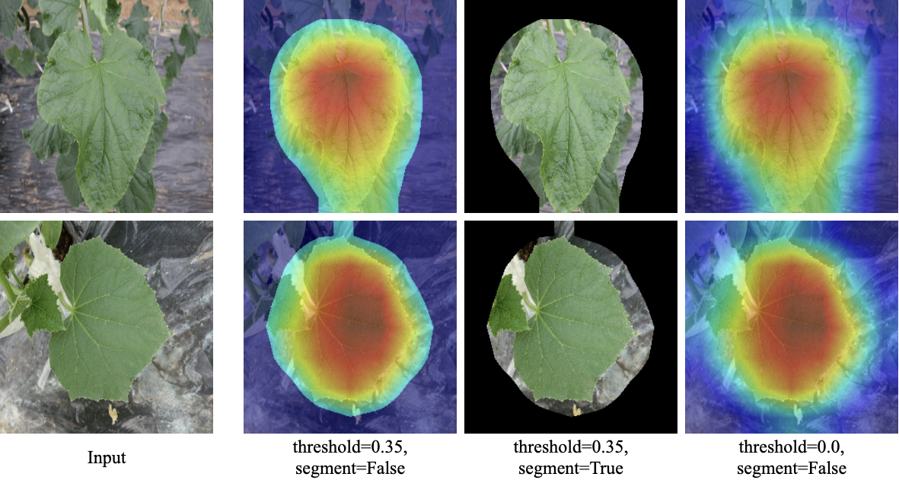

## Implementation of the LFLSeg Module for Segmenting Leaf Area


The above image shows the heatmap visualization of our LFLSeg on different scenarios (full leaf, non-leaf, partial leaf) with respect to the `full leaf` class.  
These heatmaps can be used as useful segmentation masks for training our LeafGAN model without the need of pixel-label data.
LFLSeg works well on different in-field images with complex backgrounds. 

### Extreme cases
When the images contain multiple and overlapping leaves, the LFLSeg fails to correctly segment the leaf area (last image of the `full leaf` cases).
However, we do not expect the input which contains multiple leaves to be the case since we assume the input of the disease classifier is a single leaf image in this study.

Also, LFLSeg may incorrectly detect `partial leaf` as `full leaf` if the `partial leaf` image has a different shooting distance than images in our training dataset (last column).
Applying data augmentation techniques such as random resize/scale is expected to increase the robustness of the model.

## Datasets
The key idea of the LFLSeg is the introduction of the `partial leaf` class. `Partial leaf` images are created from `full leaf` images. From one single `full leaf` image, we crop 9 patches to create 9 images for `partial leaf` class as follows.  


Dataset will have 3 classes:
- `full leaf`: image that contains a full leaf
- `partial leaf`: image that contains a part of a full leaf
- `non-leaf`: image that does not contain any part of a leaf

For more details about how to create dataset, please refer to our paper.

Please provide a `.txt` file that contain training info with label as follow:
- `full leaf`: label as 0
- `partial leaf`: label as 1
- `non-leaf`: label as 2
```
/path/to/full_leaf/full_leaf_1.JPG, 0
/path/to/full_leaf/full_leaf_2.png, 0
/path/to/full_leaf/full_leaf_3.jpg, 0
... ... ...
/path/to/partial_leaf/partial_leaf_1.JPG, 1
/path/to/partial_leaf/partial_leaf_2.jpg, 1
/path/to/partial_leaf/partial_leaf_3.png, 1
... ... ...
/path/to/non_leaf/non_leaf_1.png, 2
/path/to/non_leaf/non_leaf_2.jpg, 2
/path/to/non_leaf/non_leaf_3.JPG, 2
```

## Train LFLSeg

```bash
python train_LFLSeg.py --train /path/to/train_data.txt --test /path/to/train_data.txt
```

After training, please replace the trained model path at line 91 of the [leaf_gan_model.py](https://github.com/IyatomiLab/LeafGAN/blob/master/models/leaf_gan_model.py#L91)
```
load_path = '/path/to/LFLSeg_model.pth'
```

## Inference LFLSeg

The pretrained model of LFLSeg can be downloaded here: https://drive.google.com/drive/folders/1HqBYjUGXxl1eAkzhURoV5JAqWHvBvvTp?usp=sharing

After downloading, please replace the trained model path at line 84 of the [infer_LFLSeg.py](https://github.com/IyatomiLab/LeafGAN/blob/master/LFLSeg/infer_LFLSeg.py#L84)
```
load_path = '/path/to/LFLSeg_resnet101.pth'
```

To get the GradCAM or the mask of `full leaf` image. Run the following command:

```bash
python infer_LFLSeg.py  --input /path/to/sing_full_leaf_image
                        --segment #if not given, segment flag will be False
                        --threshold #value to get the masked image ([0.0, 1.0]), please adjust on your purposes

# For example
python infer_LFLSeg.py  --input images/leaf_01.jpg --threshold 0.35 --segment
```



## Citation

```
@article{cap2020leafgan,
  title   = {LeafGAN: An Effective Data Augmentation Method for Practical Plant Disease Diagnosis},
  author  = {Quan Huu Cap and Hiroyuki Uga and Satoshi Kagiwada and Hitoshi Iyatomi},
  journal = {IEEE Transactions on Automation Science and Engineering},
  year    = {2020},
  doi     = {10.1109/TASE.2020.3041499}
}
```