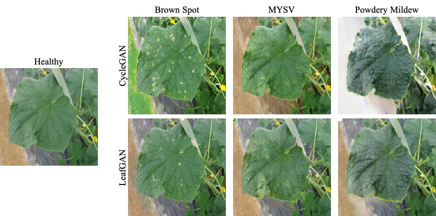
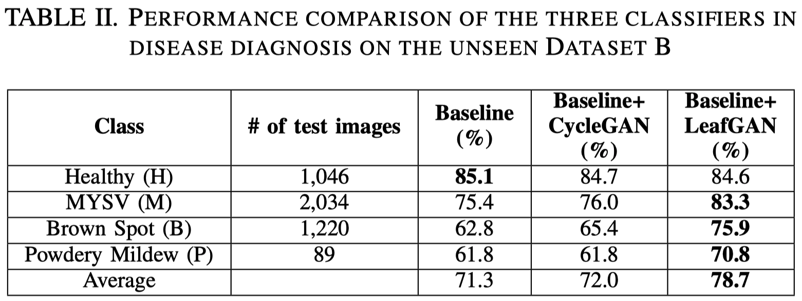

## LeafGAN &mdash; Official Pytorch Implementation



**LeafGAN: An Effective Data Augmentation Method for Practical Plant Disease Diagnosis**<br>
Quan Huu Cap, Hiroyuki Uga, Satoshi Kagiwada, Hitoshi Iyatomi<br>

Paper: https://arxiv.org/abs/2002.10100<br>
Accepted for publication in the **IEEE Transactions on Automation Science and Engineering (T-ASE)**<br>

Abstract: *Many applications for the automated diagnosis of plant disease have been developed based on the success of deep learning techniques. However, these applications often suffer from overfitting, and the diagnostic performance is drastically decreased when used on test datasets from new environments. In this paper, we propose LeafGAN, a novel image-to-image translation system with own attention mechanism. LeafGAN generates a wide variety of diseased images via transformation from healthy images, as a data augmentation tool for improving the performance of plant disease diagnosis. Thanks to its own attention mechanism, our model can transform only relevant areas from images with a variety of backgrounds, thus enriching the versatility of the training images. Experiments with five-class cucumber disease classification show that data augmentation with vanilla CycleGAN cannot help to improve the generalization, i.e. disease diagnostic performance increased by only 0.7% from the baseline. In contrast, LeafGAN boosted the diagnostic performance by 7.4%. We also visually confirmed the generated images by our LeafGAN were much better quality and more convincing than those generated by vanilla CycleGAN.*



## LFLSeg module
Tutorial of how to create dataset and train the LFLSeg module is available in the [LFLSeg](https://github.com/IyatomiLab/LeafGAN/tree/master/LFLSeg)


## Datasets
A dataset will have 4 directories for two domains A (TrainA, TestA) and B (TrainB, TestB). Each directory must contain only images (no other file types).
For example of the dataset named `healthy2brownspot`
```bash
/path/to/healthy2brownspot/trainA
/path/to/healthy2brownspot/testA
/path/to/healthy2brownspot/trainB
/path/to/healthy2brownspot/testB
```

## LeafGAN/CycleGAN train/test
- Make sure to prepare the dataset first
- Train a model (example with the dataset `healthy2brownspot`):
```bash
python train.py --dataroot /path/to/healthy2brownspot --name healthy2brownspot_leafGAN --model leaf_gan
```
To see more intermediate results, check out `./checkpoints/healthy2brownspot_leafGAN/web/index.html`.
- Test the model:
```bash
python test.py --dataroot /path/to/healthy2brownspot --name healthy2brownspot_leafGAN --model leaf_gan
```
- The test results will be saved to a html file here: `./results/healthy2brownspot_leafGAN/latest_test/index.html`.

## Citation

```
@article{cap2020leafgan,
  title   = {LeafGAN: An Effective Data Augmentation Method for Practical Plant Disease Diagnosis},
  author  = {Quan Huu Cap and Hiroyuki Uga and Satoshi Kagiwada and Hitoshi Iyatomi},
  journal = {IEEE Transactions on Automation Science and Engineering},
  year    = {2020},
  doi     = {10.1109/TASE.2020.3041499}
}
```

## Acknowledgments
Our code is inspired by [pytorch-CycleGAN](https://github.com/junyanz/pytorch-CycleGAN-and-pix2pix).